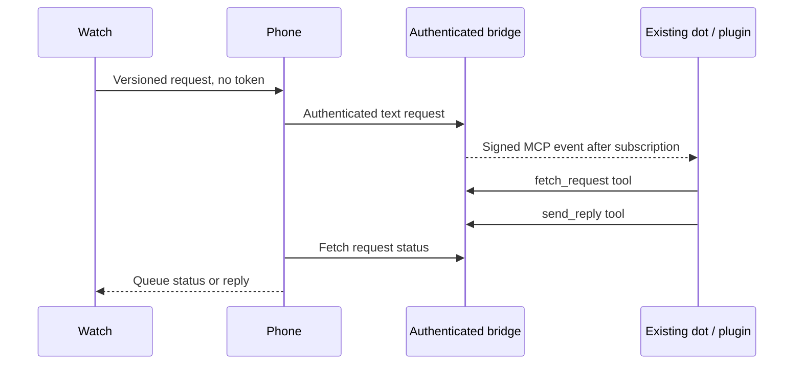

# Dot Companion for Android & Wear OS

An **unofficial community project** for an Android phone and watch companion. It uses an original animated character and keeps connection and delivery states visible.

This foundation includes a native local preview and a synthetic MCP Events text bridge. **It has not connected to a real dot.** It does not read existing ChatGPT conversations, provide native dot voice calls, or substitute an API assistant. No model calls are made.

## What this milestone delivers

| Capability | Status |
| --- | --- |
| Phone text UI and original animated companion | Native implementation; CI verification recorded in release notes |
| Round Wear OS interface | Native implementation; device validation pending |
| Durable local queue, retries, and delivery states | Implemented with shared state tests |
| Phone/watch Data Layer transport | Implemented; actual paired devices not tested |
| Local authenticated request → event → read tool → reply tool | Synthetic harness, tested locally |
| Real dot messaging via an installed plugin | Not configured or validated |
| Microphone, speech streaming, and notifications | Not enabled; no permission prompts |
| Public server, production OAuth, or Play Store release | Not deployed |

Preview replies always say **synthetic**. A local HTTP connection does not count as a dot connection. Queue receipt, webhook receipt, and a reply are distinct states.

## Run the local bridge milestone

Node.js 22 or later is enough. There are no runtime npm dependencies.

```sh
cd bridge
npm test
npm run demo
```

The demo uses a synthetic subscriber and reply tool. It does not contact ChatGPT. See [bridge/README.md](bridge/README.md) for starting the development server and configuring a local token.

## Build the native apps

Use an Android environment whose SDK terms you have already accepted: JDK 17, Python 3.9 or later, Android SDK platform 35 and Build Tools 35.0.0. Python generates offline notices from the resolved runtime graph. The Gradle 8.11.1 wrapper JAR is checksum verified and its distribution checksum is pinned. Build scripts do not accept SDK licenses or automatically install SDK packages.

```sh
./gradlew :core:test :mobile:assembleDebug :wear:assembleDebug \
  :shared-ui:testDebugUnitTest :mobile:testDebugUnitTest :wear:testDebugUnitTest \
  :shared-ui:lintDebug :mobile:lintDebug :wear:lintDebug
```

Both apps use `dev.dotcompanion.app` and must share a signing key to communicate through the Wearable Data Layer. Development APKs from the same CI build share that build's debug key; do not mix artifacts from different builds. Debug APKs are for developer testing, not a production release. Physical-device installation and microphone/notification grants remain a separate user action.

For the Android emulator, the local bridge host is `http://10.0.2.2:8787`. Only the debug manifest permits this exact cleartext host. Normal endpoints require HTTPS. Tokens stay on the phone and never cross the watch transport. No production token or client ID is included.

## Documented path to a real dot

OpenAI documents [MCP Events](https://developers.openai.com/plugins/build/mcp-events) for dots, using MCP protocol `2026-07-28`, webhook callbacks, and user-created subscriptions. The proposed path is:



This architecture is an **inference from documented event and tool interfaces**. A deployed HTTPS endpoint, production OAuth 2.1, approved plugin installation, callback verification, and a real subscription lifecycle must pass before live messaging can be claimed. The local harness is intentionally bound to loopback and does not provide production OAuth.

See the [architecture](docs/ARCHITECTURE.md), [threat model](docs/THREAT_MODEL.md), [roadmap](docs/ROADMAP.md), [bridge contract](docs/BRIDGE_CONTRACT.md), and [verification record](docs/VERIFICATION.md).

## License and affiliation

New project code is [Apache-2.0](LICENSE). Dependency licenses and trademarks remain with their owners; see [NOTICE](NOTICE) and [third-party notices](docs/THIRD_PARTY_NOTICES.md). This project is not affiliated with, endorsed by, or an official product of OpenAI or Google. No ChatGPT or demo character assets are copied.
