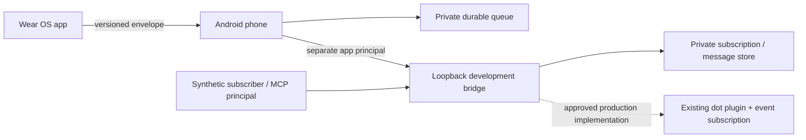

# Architecture

## Boundaries

The phone owns backend configuration and the message queue. The watch sends a small, versioned text envelope through Google Play Services Wearable Data Layer and receives queue acknowledgements separately from replies. The watch never receives bearer tokens. Both packages use the same application ID and signing certificate, as required by the [Data Layer](https://developer.android.com/training/wearables/data/sync).

`:core` is pure Kotlin/JVM: validation, request IDs, queue state, exponential retry bounds, restart recovery, and reply provenance. `:shared-ui` holds the original animated character and shared Android persistence/transport utilities. `:mobile` and `:wear` are native Compose applications. `bridge/` is a Node-only local development harness.

The dashed path is not deployed or verified. Local preview and synthetic harness results cannot establish compatibility with a real dot.

## Delivery

`queued → sending → awaiting_reply → replied` describes client progress. Failed transports retry a bounded number of times using the same request ID. HTTP success changes a request to `awaiting_reply`, not `replied`. A restarted client restores interrupted sends to the queue. Replies record their provenance so a preview response remains visibly synthetic after a mode change.

The local REST API and MCP tools are in [BRIDGE_CONTRACT.md](BRIDGE_CONTRACT.md). MCP Events discovery and subscriptions follow the [official wire documentation](https://developers.openai.com/plugins/build/mcp-events), without assuming generic SDK event helpers exist.

This event type has no replay (`cursor: null`). Requests made without a matching subscription are saved but do not generate a later event automatically. A failed callback requires subscription/bridge recovery and an explicit new request; client transport retry preserves the original ID and cannot silently reactivate a failed event.

## Live gate

The first real integration requires a selected hosting target and audience, production OAuth 2.1 with S256 PKCE and scoped resource authorization, a public HTTPS or approved development tunnel, installation of the plugin by its user, and a user-created event subscription. Verify discovery, filters, signed challenge, delivery, tool authorization, idempotent replies, revocation, refresh across restart, and unsubscribe with that actual dot.

Native voice is a later research gate. Text events do not establish a low-latency audio channel or access to existing ChatGPT history. Push-to-talk is unavailable in this release and does not request a microphone permission.
