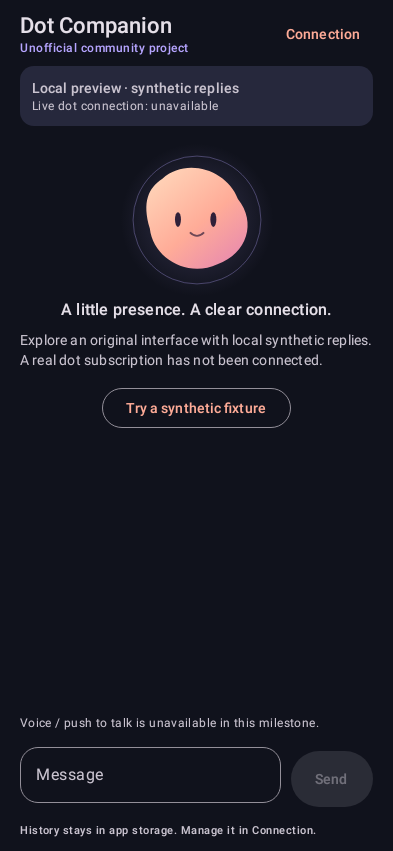
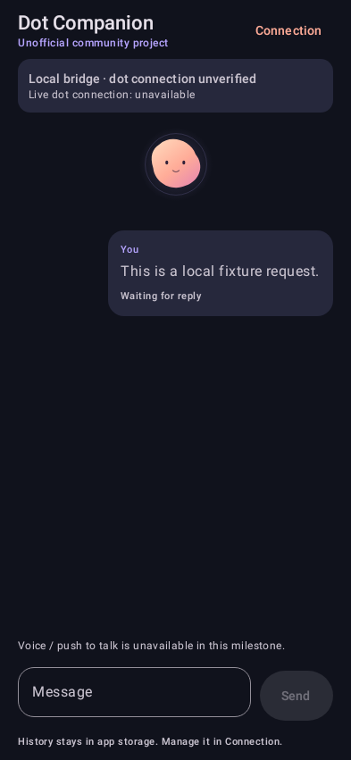
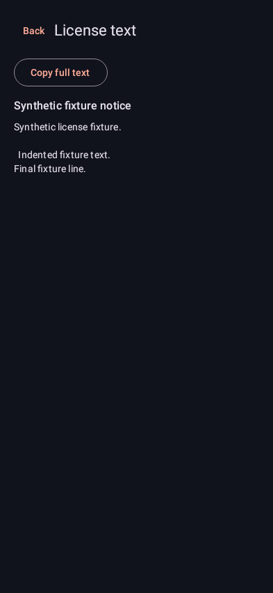
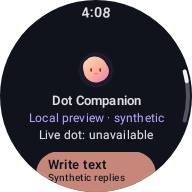
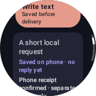
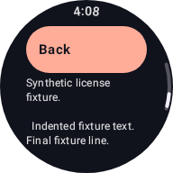

# Native test renders

These are actual native View/Canvas renders from [successful CI at `b92e035`](https://github.com/daical/dot-companion-android/actions/runs/36963111664), using Robolectric native graphics. They are unedited PNGs with synthetic fixtures, not physical-device or emulator captures. The companion is an original project design. Real-dot connectivity and voice remain unavailable.

The phone viewport is 393 × 851 dp at mdpi. Animation is disabled only in the screenshot fixtures.

| Local preview | Waiting for a reply | Offline notice reader |
| --- | --- | --- |
|  |  |  |

The round watch viewport is 192 × 192 dp at mdpi. The receipt and notice views are scrolled; content beyond the circular viewport remains available by scrolling. A receipt is explicitly separate from a reply. The watch clock scrolls away from the receipt content.

| Local preview | Phone receipt, no reply | Offline notice reader |
| --- | --- | --- |
|  |  |  |

The notice screenshots use deliberately short fixture text for visual inspection. Separate tests load the complete generated runtime notices from each app's assets without network access, and CI checks those assets inside the built APKs.
